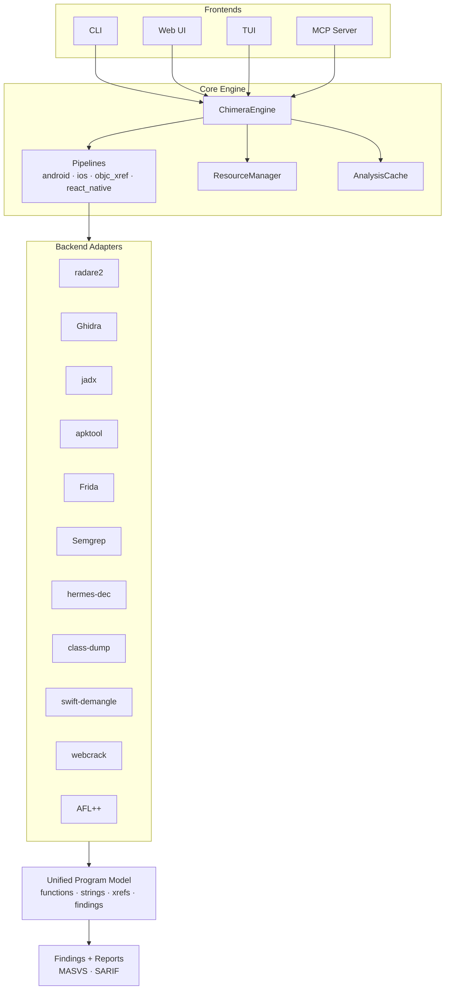
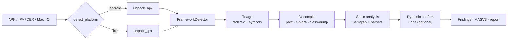

# Chimera

> Mobile reverse engineering platform. Many backends, one beast.

[](LICENSE)
[](pyproject.toml)
[](#features)
[](Dockerfile)
[](src/chimera/mcp_server.py)
[](#status)

Chimera is a unified wrapper around Ghidra, Radare2, jadx, Frida, and a
growing set of mobile-specific tools. It runs as a standalone CLI for
end-to-end APK/IPA analysis — no LLM required — and exposes an optional
MCP server so Claude or any compatible model can drive the pipeline.

---

## Features

- **Standalone pipeline** — unpack → triage → decompile → detect → confirm, no AI required.
- **Mobile-only focus** — Android (APK / AAB / DEX / split bundles) and iOS (IPA / Mach-O / dylib).
- **Cross-layer call graph** — Java / Kotlin ↔ JNI ↔ native ARM64, unified into one model.
- **Framework detection** — React Native (Hermes/JSC), Flutter, Unity IL2CPP, Xamarin, Cordova/Capacitor.
- **Protection bypass** — root / jailbreak / Frida / debugger / packer detection with bypass scripts.
- **Static + dynamic** — static rules from Semgrep, runtime confirmation via Frida.
- **MCP server** — high-level analysis tools exposed to any MCP-compatible LLM client.
- **Web UI + TUI** — FastAPI-backed UI for project browsing; Textual TUI for device interaction.
- **OWASP MASVS** — findings tagged with MASVS categories.

## Status

Alpha. The CLI, pipelines, and adapter layer are usable; the web UI is
under active development and the database-backed project store is a
follow-up. Public APIs may move without warning until a tagged release.

---

## Architecture



## Analysis pipeline



---

## Quick start

### Docker (recommended)

```bash
docker compose up -d
docker exec chimera chimera analyze /projects/app.apk
```

The image bundles pinned versions of radare2, jadx, and Ghidra. Mount your
binaries into `/projects/`:

```bash
docker run --rm -v "$PWD:/projects" chimera:latest analyze /projects/app.apk
```

### Local install

Requires Python 3.12+. External tools (radare2, jadx, Ghidra, Frida) are
discovered on `PATH` and gracefully skipped when absent.

```bash
git clone https://github.com/TyrusRC/chimera.git
cd chimera
pip install -e ".[dev]"

chimera info          # show backend availability
chimera analyze app.apk
```

---

## Usage

```bash
# Full pipeline on an APK / IPA
chimera analyze app.apk
chimera analyze app.ipa --ghidra-home /opt/ghidra

# Restore obfuscated identifiers via mapping.txt
chimera analyze app.apk --mapping-file release.mapping

# Detect protections (root / jailbreak / Frida / debugger / packer)
chimera detect-protections app.apk

# List third-party SDKs
chimera sdks app.apk

# Connected devices
chimera devices

# Web UI (FastAPI)
chimera serve

# TUI for device operations
chimera tui

# MCP server (stdio — wire into Claude Desktop / Code)
chimera mcp
```

### MCP integration

Chimera exposes high-level tools (`analyze`, `xref`, `list_devices`,
`pull_app`, `run_semgrep`, `apply_bypass`, …) over MCP. Point any
MCP-compatible client at `chimera mcp` and the model can drive the
pipeline directly.

---

## Backend matrix

| Layer            | Backend         | Used for                               |
| ---------------- | --------------- | -------------------------------------- |
| Native triage    | radare2         | functions, strings, xrefs, ObjC pool   |
| Native deep      | Ghidra          | decompilation, type inference          |
| Java / Kotlin    | jadx, apktool   | source recovery, manifest, resources   |
| iOS metadata     | class-dump      | ObjC class layout, protocols           |
| Symbol demangle  | swift-demangle  | Swift identifier recovery              |
| JS bundles       | webcrack        | bundled-JS unpacking                   |
| Hermes           | hermes-dec      | RN Hermes bytecode disassembly         |
| Static rules     | Semgrep         | MASVS rules over decompiled sources    |
| Dynamic          | Frida           | runtime hooks, bypass scripts          |
| Fuzzing          | AFL++           | native-library fuzzing harness         |

Adapters live in [`src/chimera/adapters/`](src/chimera/adapters) and all
implement the `BackendAdapter` interface
([`base.py`](src/chimera/adapters/base.py)). Adding a new backend means
dropping one file and registering it in
[`core/engine.py`](src/chimera/core/engine.py).

---

## Development

```bash
pip install -e ".[dev]"
pytest                  # full suite
pytest tests/unit       # unit tests only
```

Layout:

```
src/chimera/
├── adapters/      # backend wrappers (radare2, Ghidra, jadx, Frida, ...)
├── api/           # FastAPI routes + websocket layer
├── bypass/        # detection + Frida bypass orchestration
├── core/          # engine, config, cache, resource manager
├── device/        # adb / libimobiledevice wrappers
├── frameworks/    # framework detection (RN, Flutter, Unity, Xamarin, ...)
├── model/         # UnifiedProgramModel + SQLite schema
├── parsers/       # Mach-O ObjC, ARM64 register tracking, callsite extractor
├── pipelines/     # platform-specific orchestration (android, ios, ...)
└── mcp_server.py  # MCP entrypoint
```

Contributions welcome. Open an issue for substantial work before sending
a PR so we can align on direction.

---

## License

[Apache License 2.0](LICENSE).
