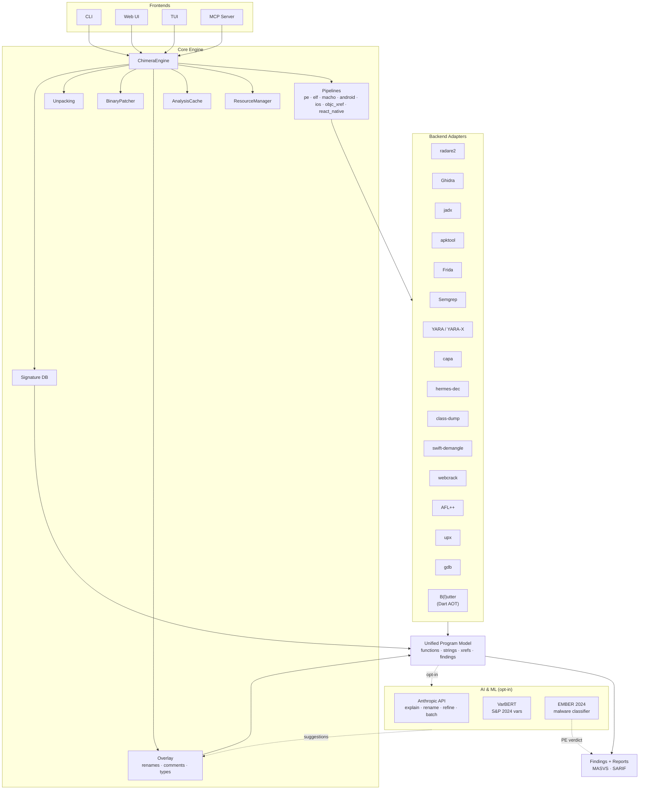
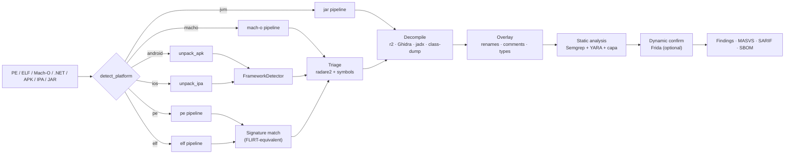

# Chimera

> Reverse engineering platform for desktop and mobile binaries. Many backends, one beast.

[](LICENSE)
[](pyproject.toml)
[](#features)
[](Dockerfile)
[](src/chimera/mcp_server.py)
[](#status)

Chimera is a unified wrapper around Ghidra, Radare2, jadx, Frida, capa,
YARA and a growing set of platform-specific tools. It analyzes Windows
PE / .NET assemblies, Linux ELF, macOS Mach-O, Android APKs and iOS
IPAs through one CLI, one project store and one HTTP API — no LLM
required — and exposes an optional MCP server so Claude or any
compatible model can drive the pipeline.

The static workflow (triage → decompile → annotate → patch → export)
runs headless out of the same Docker image as the mobile pipeline. The
desktop side adds: a FLIRT-equivalent library-function matcher, an r2 /
Ghidra side-by-side decompiler with substitution-style post-processing,
persistent renames / comments / type signatures, byte-level patching
with anti-debug recipes, a UPX auto-unpacker, packer detection
(YARA + section-name + entropy), and a gdb symbol bridge.

Optional 2024-2026 research add-ons round it out: an Anthropic-backed AI
assistant (LLM4Decompile V2-style decompiler refinement, SymGen-style
batch generative naming, Sidekick-style adversarial rename verification,
DecLLM recompile gate, Idioms / NDSS 2026 refine engine), the VarBERT
variable-name recovery model (S&P 2024), the EMBER 2024 malware
classifier, the B(l)utter Flutter / Dart AOT extractor, hermes-decomp
for React Native HBC bundles, Oxidizer (angr) for Rust binaries, a
Mergen VMProtect / Themida devirtualization stage, KEENHash + REVDECODE
similarity backends with BinDiff CSV export, a Sidekick-style notebook
for narrative findings, oatdump2binexport Android native-similarity, and
msynth + PseudoFix decompile post-processors — all opt-in, none on the
default `analyze` hot path.

---

## Features

### Cross-platform binary analysis
- **Six formats, one pipeline** — Windows PE / PE32+ / .NET assemblies, Linux ELF (statically or dynamically linked), macOS Mach-O, Android APK / AAB / DEX / split bundles, iOS IPA / dylib. Format is auto-detected; the right pipeline routes itself.
- **Standalone CLI, no AI required** — `chimera analyze` runs the full pipeline headless and writes a project to disk.
- **Cross-layer call graph** — Java / Kotlin ↔ JNI ↔ native ARM64, unified into one model.

### Desktop / native RE
- **Multi-decompiler picker** — request r2 or Ghidra (or both, side-by-side) per function via the API or web UI; output is post-processed (DAT_/PTR_/FUN_/iVar/uVar → typed locals, Itanium C++ demangling, magic-constant labelling).
- **FLIRT-equivalent library naming** — masked-byte signature pack ships 176 prefixes covering libc / libssl / libcrypto / libz; matches typed against `arch + format` so x86_64 ELF and PE32+ don't cross-pollute. Static-linked stripped binaries get function names back automatically.
- **Persistent annotations** — rename functions, add per-address comments, set C-style type signatures, override classification. Stored in `overlay.json` per binary (atomic tempfile + rename), applied to the live model on every load.
- **Byte-level patching** — `BinaryPatcher` resolves VA→file-offset for PE (section table), ELF (PT_LOAD), and Mach-O (LC_SEGMENT_64). PE checksum is recomputed automatically. Five recipe kinds: write-bytes, nop-range, force-jump-taken (validates 0x70–0x7F short conditional jumps), find-import-and-stub (PE IAT walk), find-elf-plt-and-stub (.rela.plt / .dynsym). Three anti-debug bypass recipes ship out of the box.
- **Packer detection + UPX auto-unpack** — YARA-first (UPX / ASPack / VMProtect / Themida / MPRESS / PECompact / Enigma / MEW / kkrunchy), section-name fallback (UPX0, .vmpN, .themida, .aspack, …), per-section byte-entropy heuristic on executable sections. `chimera unpack` round-trips UPX byte-identically and ships manual guidance for the VM-protectors no open-source unpacker handles cleanly.
- **gdb bridge** — `chimera gdb-export` writes a `.gdbinit` of `$convenience` variables + a `chimera-bp` user command so `gdb` lands inside the same address space your renames refer to.
- **PE / ELF imports scoring** — PEStudio-style buckets (process injection, anti-debug, persistence, network, crypto, evasion). Linux: persistence-string scan (cron / systemd / `LD_PRELOAD` / init.d), syscall scoring, XOR-string heuristic.
- **.NET assemblies** — ILSpy decompilation when `ilspycmd` is on PATH; Ghidra fallback for mixed-mode (C++/CLI). The decompiled C# is ingested into the model as one entry per type and per method, plus its string literals. For VM-protected / anti-tamper'd assemblies that defeat static devirtualization, `chimera dotnet-trace` runs the binary on Linux (via a .NET Core shim) and hooks named methods at runtime with Harmony — a hooked comparator hands back the value it checks against.

### Mobile RE
- **Framework detection** — React Native (Hermes / JSC), Flutter, Unity IL2CPP, Xamarin, Cordova / Capacitor.
- **Manifest + NSC hardening** — `chimera manifest app.apk` reports `android:debuggable`, `allowBackup` without rules, exported components without permissions, cleartext-traffic flags, `network_security_config.xml` issues (cleartext base/domain configs, user-CA trust). Each finding cites file and line.
- **Protection bypass** — root / jailbreak / Frida / debugger / packer detection with bundled bypass scripts. (Devices running `frida-server` must be jailbroken / rooted; `frida-gadget` is fine on a stock device.)
- **Dynamic attach** — `chimera attach --pid <pid>` (local) or `--target <pkg> --device <id>` (mobile) with multi-bypass preload, message drain, interactive REPL.

### Shared workflow
- **Static + dynamic** — Semgrep + YARA (or optional YARA-X) + capa for static; Frida for runtime confirmation.
- **Binary-vs-binary diff** — `chimera diff <a> <b>` reports added/removed permissions, exported components, SDKs, native libraries (with sha256), manifest + NSC findings (regression / resolution).
- **Function-similarity diff (BinDiff-style)** — `chimera diff-functions a.bin b.bin --threshold 0.85` matches functions via opcode-shingled Jaccard, two-pass (same-name first, then greedy bipartite over the cross product); `--heuristic multi` adds call-graph degree + basic-block count + mnemonic cosine. `--export-bindiff out.csv` writes BinDiff-compatible CSV for downstream tools. A whole-binary KEENHash embedding backend (ISSTA 2025) and a REVDECODE Viterbi re-ranker (USENIX Sec 2025) are implemented in the library API (`chimera.diff.function_similarity.diff_models`) but are **not yet wired to `diff-functions` CLI flags**; the KEENHash offline path is a feature-hash surrogate, not the published model.
- **Reports** — JSON, HTML, Markdown, SARIF v2.1.0, CycloneDX 1.6 SBOM, MASVS coverage matrix, CVSS finding draft.
- **Annotation sharing** — `chimera overlay export <bin> -o overlay.json` and `chimera overlay import <bin> -i overlay.json --merge|--replace` move renames / comments / types between analysts. Schema includes the binary sha256 so import against a different binary surfaces a warning rather than silently corrupting addresses. Exported payload also carries the project notebook.
- **Notebook** — `chimera notes add --title T --body B --evidence 0xADDR ...` / `notes list [--tag T]` / `notes rm ID`, plus `/api/projects/{id}/notes`. Sidekick-style narrative findings with evidence links to addresses or lines. Stored in the project overlay; round-trips through export/import.
- **Web UI + TUI** — FastAPI-backed UI with Monaco editor (right-click rename / comment / set-type, plus AI explain / AI rename buttons when an API key is set), Textual TUI for device interaction.
- **MCP server** — high-level analysis tools exposed to any MCP-compatible LLM client.
- **OWASP MASVS** — findings tagged with MASVS categories.

### AI-assisted RE (optional, opt-in)
- **LLM-backed explain / rename / comment** — `chimera ai explain <bin> <addr>` and `/api/projects/{id}/ai/{explain,rename,comment}`. The Web UI exposes "AI explain" + "AI rename" buttons in the CodeView header (hidden when no key configured).
- **LLM4Decompile-V2-style refinement** — `chimera ai refine-decomp <bin> <addr> --backend ghidra` asks the model to clean up Ghidra pseudo-C (rename `iVar1`/`FUN_xxxxx`, tighten control flow) **without inventing semantics**. Strictly preview; never writes to overlay.
- **Pluggable refine engines** — `chimera ai engines` lists registered engines; `--engine idioms` switches to the Idioms checkpoint (Dramko et al., NDSS 2026) when `CHIMERA_IDIOMS_CHECKPOINT` and `transformers` are present. Future jTrans-refine / FidelityGPT / SK2Decompile slot in without API churn.
- **DecLLM recompile gate** — `chimera ai refine-decomp ... --recompile-check` pipes the refined C through `gcc -fsyntax-only`; on failure the model gets one repair round with the literal compiler diagnostics. Off by default.
- **MBA + PseudoFix post-processing** — `--postprocess` applies msynth-style mixed-boolean-arithmetic simplifications and PseudoFix-style (ASE 2025) safe structural rewrites (collapse `if (x) return a; return b;` → ternary, drop `do {} while(0)` wrappers).
- **REALTYPE-style eval harness** — `chimera ai eval-decomp dataset.jsonl --engine claude` scores any refine engine against a JSONL of decompiled-vs-ground-truth records: recompile rate, identifier Jaccard, struct-name recall.
- **SymGen-style batch generative naming** — `chimera ai batch-rename <bin> --max 50 --threshold 0.7 --apply` walks stripped-looking functions (FUN_/sub_/fn_), feeds callgraph neighbours as context, asks for `{name, confidence}` JSON, optionally applies high-confidence names to the overlay. Preview by default.
- **Sidekick-style adversarial rename verifier** — `chimera ai batch-rename ... --verify` makes a second LLM call that defaults to *refute* the suggested name; refuted names are never auto-applied even with `--apply`.
- **Configuration** — `ANTHROPIC_API_KEY` env var enables the surface; `CHIMERA_AI_MODEL` overrides the model (default `claude-sonnet-4-6`); urllib-only client, no SDK dep. Missing key → HTTP 503 with a clear message; the CLI prints an actionable install hint.
- **Research add-ons (extras)** — VarBERT variable-name recovery (`chimera varbert rename`, `pip install "chimera[varbert]"`), EMBER 2024 malware classifier (`chimera classify <pe>`, `pip install "chimera[ml]"`), B(l)utter Flutter / Dart AOT extractor (`chimera flutter-extract <apk> -o out`, external `blutter` binary on PATH or `CHIMERA_BLUTTER_BIN`), hermes-decomp for Hermes HBC bundles (`chimera hermes-decompile <bundle>`, external `hermes-decomp` binary), Oxidizer Rust decompile via angr (`chimera rust-decompile <bin>`, `pip install angr`), Mergen VMProtect / Themida devirtualization (`chimera vmp-devirt <bin> --start 0x…`, external `mergen` binary), oatdump2binexport Android native similarity (`chimera android-similarity a.apk b.apk`, needs `dex2oat` + `oatdump2binexport` + `bindiff`). Each degrades to a clear "not installed / unavailable" result when its external binary or model weights are absent (none ship in-repo). Several are integration scaffolding rather than full in-repo implementations — notably the BinQuery adapter (CLI path unwired), the FirmAgent loop (default hooks are no-ops), the KEENHash offline embedding (feature-hash surrogate), and the EMBER fallback feature extractor.

## Desktop reverse engineering

Chimera ships a desktop RE workflow that mirrors the muscle-memory of
IDA Pro / Ghidra / Binary Ninja, driven from the same CLI and the same
HTTP API as the mobile pipeline.

### What you get

| Workflow                                                  | How                                                                              |
| --------------------------------------------------------- | -------------------------------------------------------------------------------- |
| Open a PE / ELF / Mach-O / .NET binary, list functions    | `chimera analyze <file>`                                                         |
| Pick a decompiler per function (r2, Ghidra, or both)      | `GET /api/projects/{id}/functions/{addr}/decomp?backend=r2|ghidra|all`           |
| Rename, comment, set type — persisted across sessions     | `POST /api/projects/{id}/annotations/{rename,comment,type,classify}`             |
| Auto-name statically-linked library functions             | Phase 5.5 (ELF) / Phase 6.5 (PE) signature matcher, runs during `analyze`        |
| Patch a binary (raw bytes, recipes, or nop-range)         | `chimera patch <file> --addr 0x… --bytes 90909090`                               |
| Bypass `IsDebuggerPresent` / `CheckRemoteDebuggerPresent` / `ptrace` | `chimera patch <file> --recipe pe-isdebuggerpresent-nop --out patched.exe` |
| Hand the patched binary to `gdb` with your renames        | `chimera gdb-export <file> --out hello.gdbinit` then `gdb -x hello.gdbinit ./hello` |
| Detect + auto-unpack a packed binary                      | `chimera unpack <file>` (or `--detect-only` to inspect first)                    |
| Diff two cached projects                                  | `chimera diff <sha-a> <sha-b>`                                                   |
| Export findings as SARIF for CI                           | `chimera report <file> --format sarif`                                           |

### Quick start (desktop)

```bash
# Triage a PE
chimera analyze /path/to/sample.exe
chimera imports /path/to/sample.exe                   # bucket-grouped suspicious imports

# Triage a Linux ELF (statically linked → signature matcher fires)
chimera analyze /path/to/server.bin
chimera persistence /path/to/server.bin               # cron / systemd / LD_PRELOAD strings

# Patch out IsDebuggerPresent and save a clean copy
chimera patch /path/to/sample.exe --recipe pe-isdebuggerpresent-nop --out clean.exe

# Or patch raw bytes at a virtual address (dry-run first)
chimera patch /path/to/sample.exe --addr 0x140001000 --bytes 9090909090909090 --dry-run

# Detect packer + auto-unpack (UPX) — emits manual guidance for VM-protectors
chimera unpack /path/to/packed.bin
chimera unpack /path/to/packed.bin --detect-only

# Hand the analysis off to gdb
chimera gdb-export /path/to/server.bin --out server.gdbinit
gdb -x server.gdbinit /path/to/server.bin

# Open the web UI and right-click → "Rename function…" / "Add comment…"
chimera serve --port 8765
# then browse http://localhost:8765
```

### Interactive workflow (web UI)

Open a project, jump to a function, and the Monaco editor exposes
three right-click actions backed by the annotation API:

- **Rename function…** (F2) — persisted to `overlay.json`, re-applied
  on every reload, surfaces in subsequent decompilation passes.
- **Add comment on this line** — per-address comments keyed by line.
- **Set function signature…** — C-style prototype, used to retype
  arguments / return value in the post-processor.

Switch the decompiler dropdown between r2 and Ghidra to compare output
on the same function side by side.

### Library function naming (FLIRT-equivalent)

A 176-entry signature pack ships at
`src/chimera/data/sigs/libfn-x86_64.json`, masking call-target / RIP-relative
operands so the same prefix matches across compiler versions. Build
your own pack with `scripts/build_libfn_sigs.py` against any reference
library; the matcher runs after r2 triage so it only renames functions
the disassembler already extracted.

### Patch recipes

Three anti-debug bypass recipes ship bundled and are listed by
`chimera patch --list-recipes`:

- `pe-isdebuggerpresent-nop` — find kernel32!IsDebuggerPresent in the
  IAT, replace the function body with `xor eax, eax; ret`.
- `pe-checkremotedebuggerpresent-nop` — same for
  `CheckRemoteDebuggerPresent`.
- `elf-ptrace-zero` — walk `.rela.plt` / `.dynsym`, stub the `ptrace`
  PLT thunk so it returns 0 instead of calling through.

Add your own under `src/chimera/patching/recipe_packs/` — JSON, no code
required for the simple kinds.

### Optional tools

External binaries discovered on `PATH`:

- `floss` (`pip install flare-floss`) — string deobfuscation for PE/ELF.
- `ilspycmd` (`dotnet tool install -g ilspycmd`) — .NET decompilation.
- `capa` (`pip install flare-capa`) — capability matching.
- `upx` (`apt-get install upx-ucl`) — auto-unpack for UPX-packed binaries.
- `gdb` — for the `gdb-export` handoff.
- `yara-x` (`cargo install yara-x-cli`) — modern Rust YARA rewrite. Activate with `CHIMERA_USE_YARA_X=1`; falls back to legacy `yara` when absent.
- `blutter` (build from [worawit/blutter](https://github.com/worawit/blutter)) — Flutter / Dart AOT snapshot extractor. Discovery: `PATH` or `CHIMERA_BLUTTER_BIN`.
- `hermes-decomp` (build from [SymbioticSec/hermes-decomp](https://github.com/SymbioticSec/hermes-decomp)) — Rust-based React Native Hermes bytecode decompiler. Discovery: `PATH` or `CHIMERA_HERMES_DECOMP_BIN`.
- `mergen` (build from [NaC-L/Mergen](https://github.com/NaC-L/Mergen)) — LLVM-IR-based VMProtect / Themida devirtualizer. Discovery: `PATH` or `CHIMERA_MERGEN_BIN`.
- `dex2oat`, `oatdump2binexport`, `bindiff` — needed by `chimera android-similarity` (APK → OAT → BinExport → BinDiff). `oatdump2binexport` via `PATH` or `CHIMERA_OATDUMP2BINEXPORT_BIN`.

Optional Python extras (gated to keep the default wheel lean):

- `pip install "chimera[varbert]"` — VarBERT variable-name recovery model (Pal et al., S&P 2024). Adds `chimera varbert rename` + `/api/projects/{id}/varbert/rename`.
- `pip install "chimera[ml]"` — LightGBM + lief for the EMBER 2024 malware classifier. Adds `chimera classify`. Drop a model at `src/chimera/detection_engineering/data/ember/model.txt` or point `CHIMERA_EMBER_MODEL` at one.
- `pip install "chimera[capa]"` — heavyweight capability matching (`flare-capa>=9.4` — PyGhidra backend + span-of-calls dynamic scope). `CHIMERA_CAPA_BACKEND=pyghidra` opts into the faster static analyzer.
- `pip install "chimera[dynamic]"` — `frida-python` for `chimera attach` / Frida workflows.
- `pip install angr` — enables `chimera rust-decompile` via Oxidizer (Liu et al., S&P 2026). Heavyweight; left out of any extras to keep environments lean.
- `pip install transformers torch` + `CHIMERA_IDIOMS_CHECKPOINT=/path/to/squaresLab/idioms-6.7b` — enables `--engine idioms` on `ai refine-decomp` (Dramko et al., NDSS 2026).

AI assistant config (no extra to install — uses urllib):

- `ANTHROPIC_API_KEY` — required to enable `chimera ai ...` and the SPA's AI buttons. Without it, every AI surface fails soft (HTTP 503 with a clear hint).
- `CHIMERA_AI_MODEL` — override the model (default `claude-sonnet-4-6`).
- `ANTHROPIC_BASE_URL` — point at a proxy / local endpoint.
- `CHIMERA_RECOMPILE_CC` — compiler used by the DecLLM-style `--recompile-check` (default: first of `gcc`/`clang`/`cc` on `PATH`).

All optional; pipelines skip gracefully when a tool isn't installed.
The Docker image bundles all of the external binaries above except
`floss`, `ilspycmd` and `capa` (off by default to avoid dependency
clashes — opt in with `--build-arg INSTALL_CAPA=1`).

### Limitations

- **No Hex-Rays-quality decompiler.** Ghidra is good and the
  post-processor cleans it up, but for heavily-optimised C++ Hex-Rays
  is still the gold standard. The AI refinement pass closes the gap on
  readability, not on accuracy — it's instructed never to invent
  semantics, so it can't recover what Ghidra dropped.
- **No interactive structure recovery** — you can rename and retype,
  but there's no "Edit → Structure" editor inside chimera yet. (ReSym
  CCS 2024 ships struct synthesis with ~10GB checkpoints — tracked as a
  research-grade follow-up.)
- **No native debugger UX** — debugging happens via the gdb bridge, not
  inside chimera.
- **VMP / Themida devirtualization** ships through Mergen (LLVM-IR
  lift; `chimera vmp-devirt`) — useful when the protected region is
  well-bounded, not a magic auto-pwn. The packer-detection table still
  emits manual guidance for commercial protectors that don't lift
  cleanly.
- **No first-class symbolic execution** — angr is reachable through the
  Oxidizer Rust path, and the Phrack 72.15 E0 selective-symbolic-
  instrumentation primitive is sketched out as a research shim, but
  there's no `chimera symex` driver yet.
- No sandbox.
- Authenticode signatures are detected (presence) but not validated.
- Mixed-mode .NET (C++/CLI) falls back to Ghidra.

---

## Memory image triage (Linux)

Chimera analyzes Linux memory captures (LiME / raw) via Volatility 3.
Coverage:

- **Process tree** (`linux.pslist`, `linux.pstree`)
- **Recovered bash history** (`linux.bash`)
- **Open sockets** (`linux.sockstat`, falls back to `linux.netstat`)
- **Malfind RWX hits** (`linux.malfind`)
- **Kernel modules + rootkit indicators** (`linux.lsmod`,
  `linux.check_modules`, `linux.check_syscall`)
- **Persistence-relevant cached files** (`linux.pagecache.Files`
  cross-referenced against cron / systemd / `LD_PRELOAD` / init.d patterns)
- **Auto-stub IR findings** mapped to MITRE ATT&CK (T1014, T1055, T1543, T1071)

### Quick start

```sh
chimera memory /path/to/core.lime           # full pipeline + summary
chimera memory pslist /path/to/core.lime    # process list only
chimera memory netstat /path/to/core.lime   # connections only
chimera memory malfind /path/to/core.lime   # RWX hits only
chimera memory findings /path/to/core.lime  # IR findings (Markdown)
chimera report --format ir /path/to/core.lime --out report.ir.md
```

### Required tools

- **Volatility 3** (`pip install volatility3` or distro package). Make sure
  `vol` is on PATH. Volatility also needs Linux ISFs (kernel symbol tables)
  for the target image — see Volatility 3 docs.
- All optional; when `vol` is missing, the pipeline degrades to detection
  + format identification only.

### Limitations

- **Linux only** for now. Windows memory triage isn't wired up.
- **No symbolic execution / behavioral reconstruction.** Volatility
  output goes through Chimera's parsers as-is; deeper analysis is the
  analyst's job.
- **Memory-image fixtures are tiny synthetic stubs.** Real triage runs
  need GB-scale captures + matching ISF symbols.

---

## Status

Alpha. The CLI, pipelines, and adapter layer are usable; the web UI is
under active development and the database-backed project store is a
follow-up. Public APIs may move without warning until a tagged release.

---

## Architecture


```mermaid
flowchart TB
    subgraph Frontends
        CLI[CLI]
        Web[Web UI]
        TUI[TUI]
        MCP[MCP Server]
    end

    subgraph Core["Core Engine"]
        Engine[ChimeraEngine]
        Pipelines["Pipelines<br/>pe · elf · macho · android · ios · objc_xref · react_native"]
        ResMgr[ResourceManager]
        Cache[AnalysisCache]
        Overlay["Overlay<br/>renames · comments · types"]
        Patcher[BinaryPatcher]
        Unpack[Unpacking]
        SigDB[Signature DB]
    end

    subgraph Adapters["Backend Adapters"]
        R2[radare2]
        Ghidra[Ghidra]
        Jadx[jadx]
        Apktool[apktool]
        Frida[Frida]
        Semgrep[Semgrep]
        YARA["YARA / YARA-X"]
        Capa[capa]
        Hermes[hermes-dec]
        ClassDump[class-dump]
        Swift[swift-demangle]
        Webcrack[webcrack]
        AFL[AFL++]
        UPX[upx]
        Gdb[gdb]
        Blutter["B(l)utter<br/>(Dart AOT)"]
    end

    subgraph AI["AI &amp; ML (opt-in)"]
        Claude["Anthropic API<br/>explain · rename · refine · batch"]
        VarBert["VarBERT<br/>S&amp;P 2024 vars"]
        Ember["EMBER 2024<br/>malware classifier"]
    end

    Model["Unified Program Model<br/>functions · strings · xrefs · findings"]
    Findings["Findings + Reports<br/>MASVS · SARIF"]

    CLI --> Engine
    Web --> Engine
    TUI --> Engine
    MCP --> Engine
    Engine --> Pipelines
    Engine --> ResMgr
    Engine --> Cache
    Engine --> Overlay
    Engine --> Patcher
    Engine --> Unpack
    Engine --> SigDB
    Pipelines --> Adapters
    Adapters --> Model
    Overlay --> Model
    SigDB --> Model
    Model --> Findings
    Model -. opt-in .-> AI
    AI -. suggestions .-> Overlay
    Ember -. PE verdict .-> Findings
```

## Analysis pipeline


```mermaid
flowchart LR
    Input[PE / ELF / Mach-O / .NET / APK / IPA / JAR] --> Detect{detect_platform}
    Detect -->|pe| PE[pe pipeline]
    Detect -->|elf| ELF[elf pipeline]
    Detect -->|macho| MO[mach-o pipeline]
    Detect -->|android| UnpackA[unpack_apk]
    Detect -->|ios| UnpackI[unpack_ipa]
    Detect -->|jvm| JAR[jar pipeline]

    PE --> Sigs["Signature match<br/>(FLIRT-equivalent)"]
    ELF --> Sigs
    MO --> Triage
    UnpackA --> Framework[FrameworkDetector]
    UnpackI --> Framework
    JAR --> Decompile
    Framework --> Triage["Triage<br/>radare2 + symbols"]
    Sigs --> Triage
    Triage --> Decompile["Decompile<br/>r2 · Ghidra · jadx · class-dump"]
    Decompile --> Overlay["Overlay<br/>renames · comments · types"]
    Overlay --> Static["Static analysis<br/>Semgrep + YARA + capa"]
    Static --> Confirm["Dynamic confirm<br/>Frida (optional)"]
    Confirm --> Report["Findings · MASVS · SARIF · SBOM"]
```

---

## Quick start

### Docker (recommended)

```bash
docker compose up -d
docker exec chimera chimera analyze /projects/app.apk
```

The image bundles pinned versions of radare2, jadx, and Ghidra. Mount your
binaries into `/projects/`:

```bash
docker run --rm -v "$PWD:/projects" chimera:latest analyze /projects/app.apk
```

### Local install

Requires Python 3.12+. External tools (radare2, jadx, Ghidra, Frida) are
discovered on `PATH` and gracefully skipped when absent.

```bash
git clone https://github.com/TyrusRC/chimera.git
cd chimera
scripts/setup.sh       # interactive: choose native (.venv) or Docker
```

`scripts/setup.sh --native` installs `chimera[dev]` into `.venv` (via
`uv` when available) and offers to `apt-get install` the free system
tools (radare2, upx-ucl, gdb). `scripts/setup.sh --docker` builds the
bundled-toolchain image and starts Postgres instead — see
[Docker](#docker-recommended) above. Neither is required for the other; add
`--yes` to skip prompts.

```bash
chimera doctor         # exhaustive external-tool + env health check
chimera info            # quick backend-availability glance
chimera analyze app.apk
```

`chimera doctor` sweeps every optional tool this README documents
(Ghidra, jadx, capa, frida, blutter, ...) plus environment config
(`ANTHROPIC_API_KEY`, `CHIMERA_DB_URL`, Docker) and prints an install
hint for anything missing. It exits non-zero only if neither core
decompiler (radare2, Ghidra) is available — everything else is
optional and never fails the check.

---

## Usage

```bash
# Full pipeline on an APK / IPA
chimera analyze app.apk
chimera analyze app.ipa --ghidra-home /opt/ghidra

# Restore obfuscated identifiers via mapping.txt
chimera analyze app.apk --mapping-file release.mapping

# Detect protections (root / jailbreak / Frida / debugger / packer)
chimera detect-protections app.apk

# Manifest + NSC hardening findings (Android)
chimera manifest app.apk
chimera manifest app.apk --format json

# Compare two app versions
chimera analyze app-1.0.0.apk
chimera analyze app-1.1.0.apk
chimera diff <sha256-a> <sha256-b>            # markdown output
chimera diff <sha256-a> <sha256-b> --format json

# List third-party SDKs
chimera sdks app.apk

# Extract IoCs (URLs, IPs, hosts, paths, mailto) from cached analysis
chimera ioc app.apk

# List JNI bindings (Java native methods ↔ native symbols)
chimera jni app.apk

# List PE imports grouped by suspicious-imports bucket
chimera imports sample.exe

# Author a custom YARA rule against analyzed strings
chimera yara app.apk --rule-name my_rule

# Frida — list bundled bypass scripts, show one, or run on a device session
chimera frida list
chimera frida show ssl-pinning-bypass
chimera frida run --session <id> --script ssl-pinning-bypass

# Generate a report as SARIF (for SARIF-aware tooling)
chimera report app.apk --format sarif --out app

# Desktop RE — patch, gdb-export, unpack, attach
chimera patch sample.exe --list-recipes
chimera patch sample.exe --recipe pe-isdebuggerpresent-nop --out clean.exe
chimera patch sample.exe --addr 0x140001000 --bytes 9090909090909090 --dry-run

chimera gdb-export server.bin --out server.gdbinit
gdb -x server.gdbinit ./server.bin

chimera unpack packed.bin                # detect + auto-unpack (UPX)
chimera unpack packed.bin --detect-only  # inspect first; emits guidance for VM-protectors

chimera attach --pid 12345                                 # local process via Frida
chimera attach --target com.example.app --device usb       # mobile attach
chimera attach --pid 12345 --bypass anti_debug --interactive  # multi-bypass + REPL

# AI-assisted (requires ANTHROPIC_API_KEY)
chimera ai explain server.bin 0x1234
chimera ai rename  server.bin 0x1234
chimera ai comment server.bin 0x1234 --line 12
chimera ai engines                                                  # list refine engines
chimera ai refine-decomp server.bin 0x1234 --backend ghidra
chimera ai refine-decomp server.bin 0x1234 --backend ghidra \
    --engine idioms --recompile-check --postprocess                 # full stack
chimera ai eval-decomp dataset.jsonl --engine claude                # REALTYPE-style scoring
chimera ai batch-rename server.bin --max 50 --threshold 0.7         # preview
chimera ai batch-rename server.bin --max 50 --threshold 0.7 \
    --apply --verify                                                # Sidekick-style refute pass

# Notebook (narrative findings with evidence)
chimera notes add server.bin --title "AES key derivation" \
    --body "Uses PBKDF2 with hardcoded salt" \
    --evidence 0x1234 --evidence 0x1300 --tag crypto
chimera notes list server.bin --tag crypto

# Hermes / Rust / VMP / Android-native paths
chimera hermes-decompile app/index.android.bundle -o out/
chimera rust-decompile target/release/agent --limit 50
# Recover a key from a VM-protected .NET validator by hooking its
# comparator at runtime (needs the .NET SDK):
chimera dotnet-trace validator.exe --method CompareKey --input GUESS
chimera vmp-devirt packed.exe --start 0x401000 -o out/
chimera android-similarity v1.apk v2.apk -o diff_out/

# Function-similarity (BinDiff-style; Jaccard + greedy bipartite)
chimera diff-functions a.bin b.bin --threshold 0.85
chimera diff-functions a.bin b.bin --heuristic multi   # +call-graph/BB/mnemonic signals
chimera diff-functions a.bin b.bin --export-bindiff matches.csv
# NOTE: the KEENHash backend and REVDECODE re-ranker exist in the library API
# (chimera.diff.function_similarity.diff_models) but are not yet exposed as CLI
# flags; the KEENHash offline path is a feature-hash surrogate, not the model.

# Capa with new sandbox / backend options
chimera analyze sample.exe                                          # static (vivisect)
CHIMERA_CAPA_BACKEND=pyghidra chimera analyze sample.exe            # faster static
# Span-of-calls dynamic scope from a CAPE/DRAKVUF/VMRay report:
capa -f cape report.json                                            # (until exposed as a flag)

# Research add-ons (optional extras)
chimera varbert rename  server.bin 0x1234 --variant ghidra-O2 --apply
chimera classify sample.exe --threshold 0.5 --format json
chimera flutter-extract unpacked_apk_dir -o out                     # auto-detects libapp.so

# BinDiff-style function similarity (any two analyzed binaries)
chimera diff-functions a.bin b.bin --threshold 0.85 --format text

# Annotation sharing — portable overlay export/import
chimera overlay export server.bin -o server.overlay.json
chimera overlay import server.bin -i server.overlay.json --mode merge

# Connected devices
chimera devices

# Web UI (FastAPI)
chimera serve

# TUI for device operations
chimera tui

# MCP server (stdio — wire into Claude Desktop / Code)
chimera mcp
```

### MCP integration

Chimera exposes high-level tools (`analyze`, `xref`, `list_devices`,
`pull_app`, `run_semgrep`, `apply_bypass`, …) over MCP. Point any
MCP-compatible client at `chimera mcp` and the model can drive the
pipeline directly.

**Claude Code**: the repo ships a project-scoped `.mcp.json` that
registers `chimera mcp` (via `.venv/bin/chimera`, so no PATH setup
needed). Run `claude` from the repo root, approve the server on first
launch, then check it connected with `claude mcp list`. For Claude
Desktop or another client, point it at `<repo>/.venv/bin/chimera mcp`
(stdio) the same way.

`tests/integration/test_mcp_protocol.py` drives `chimera mcp` with the
`mcp` SDK's client (`stdio_client` / `ClientSession`) — a real
initialize → `list_tools` → `call_tool` round trip, no API key needed.
It's the check that the server actually speaks MCP correctly, as
opposed to `tests/unit/test_mcp_server.py`, which only unit-tests two
internal helper functions.

---

## Backend matrix

| Layer             | Backend         | Used for                                            |
| ----------------- | --------------- | --------------------------------------------------- |
| Native triage     | radare2         | functions, strings, xrefs, ObjC pool, r2 decompile  |
| Native deep       | Ghidra          | decompilation, type inference                       |
| .NET              | ilspycmd        | per-type C# decompilation (Ghidra fallback)         |
| Java / Kotlin     | jadx, apktool   | source recovery, manifest, resources                |
| iOS metadata      | class-dump      | ObjC class layout, protocols                        |
| Symbol demangle   | swift-demangle  | Swift identifier recovery                           |
| JS bundles        | webcrack        | bundled-JS unpacking                                |
| Hermes            | hermes-dec      | RN Hermes bytecode disassembly                      |
| Static rules      | Semgrep         | MASVS rules over decompiled sources                 |
| Pattern scanning  | YARA / YARA-X   | packer detection, malware fingerprints (`CHIMERA_USE_YARA_X=1` for the Rust rewrite) |
| Capabilities      | capa            | high-level behavior tagging (optional)              |
| Dynamic           | Frida           | runtime hooks, bypass scripts, `chimera attach`     |
| Fuzzing           | AFL++           | native-library fuzzing harness                      |
| Unpacking         | upx             | UPX auto-unpack (UPX0 / UPX1)                       |
| Debugger handoff  | gdb             | `chimera gdb-export` consumes `.gdbinit`            |
| AI assistant      | Anthropic API   | `chimera ai {explain,rename,comment,refine-decomp,batch-rename,eval-decomp}` (urllib, no SDK) |
| Refine engine     | Claude / Idioms | `--engine {claude,idioms}`; Idioms (NDSS 2026) via `CHIMERA_IDIOMS_CHECKPOINT`           |
| AI verifier       | second LLM call | Sidekick-style adversarial rename refutation (`ai batch-rename --verify`)               |
| Recompile gate    | gcc -fsyntax-only | DecLLM (ISSTA 2025) one repair round (`ai refine-decomp --recompile-check`)           |
| Post-processors   | msynth + PseudoFix | MBA simplifier + structural refactor (`ai refine-decomp --postprocess`)              |
| Variable-name AI  | VarBERT         | S&P 2024 transformer; `chimera varbert rename` (`[varbert]` extra) |
| Malware verdict   | EMBER 2024      | LightGBM PE classifier; `chimera classify` (`[ml]` extra) |
| Flutter / Dart    | B(l)utter       | Dart AOT snapshot extraction; `chimera flutter-extract` (external binary) |
| Hermes (RN)       | hermes-dec / hermes-decomp | Disassembly + Rust-based decompile; `chimera hermes-decompile` |
| Rust              | Oxidizer (angr) | Rust-aware decompile (S&P 2026); `chimera rust-decompile`                |
| VMP / Themida     | Mergen          | LLVM-IR-based devirt (DEF CON 33); `chimera vmp-devirt`                  |
| Android-native sim | dex2oat + oatdump2binexport + bindiff | OAT-level similarity (Phrack 72.13); `chimera android-similarity` |
| Function diff     | Jaccard / multi-heuristic / KEENHash / REVDECODE | `chimera diff-functions`; backends + Viterbi re-ranker + BinDiff CSV export |
| Notebook          | overlay-backed  | Narrative findings with evidence links; `chimera notes` + `/api/.../notes` |

Adapters live in [`src/chimera/adapters/`](src/chimera/adapters) and all
implement the `BackendAdapter` interface
([`base.py`](src/chimera/adapters/base.py)). Adding a new backend means
dropping one file and registering it in
[`core/engine.py`](src/chimera/core/engine.py).

---

## Development

```bash
scripts/setup.sh --native   # or: pip install -e ".[dev]"
pytest                       # full suite
pytest tests/unit            # unit tests only
pytest tests/integration/test_mcp_protocol.py  # MCP protocol round trip
```

Layout:

```
src/chimera/
├── adapters/      # backend wrappers (radare2, Ghidra, jadx, Frida, varbert, yara-x, blutter, ...)
├── ai/            # urllib Anthropic client + prompt templates + shared parsers
├── api/           # FastAPI routes + websocket (annotations, decomp, ai, varbert, flutter, overlay_io, ...)
├── bypass/        # detection + Frida bypass orchestration
├── cli/           # Click CLI as a package — one module per command group
├── core/          # engine, config, cache, resource manager, overlay
├── data/sigs/     # FLIRT-equivalent library function signature packs
├── detection_engineering/  # CVSS findings, SARIF, MASVS, EMBER classifier
├── device/        # adb / libimobiledevice wrappers
├── diff/          # binary-vs-binary diff + function-similarity (pluggable backends)
├── frameworks/    # framework detection (RN, Flutter, Unity, Xamarin, ...)
├── model/         # UnifiedProgramModel + SQLite schema
├── parsers/       # Mach-O ObjC, ARM64 register tracking, function signatures
├── patching/      # BinaryPatcher, recipes, recipe packs
├── pipelines/     # platform-specific orchestration (pe, elf, macho, android, ios, ...)
├── report/        # builder.py (data layer) + html.py (presentation layer)
├── unpacking/     # YARA + section + entropy detect; UPX shell-out; guidance
└── mcp_server.py  # MCP entrypoint
```

Contributions welcome. Open an issue for substantial work before sending
a PR so we can align on direction.

---

## License

[Apache License 2.0](LICENSE).
